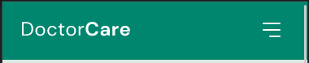

# DoctorCare Landing Page

Welcome to the README for the DoctorCare landing page. This landing page is designed to provide a simple and effective introduction to DoctorCare's medical services. The HTML code provided is the foundation of the landing page, showcasing key sections such as navigation, home, services, about, contact, and footer.

## Table of Contents

- [DoctorCare Landing Page](#doctorcare-landing-page)
  - [Table of Contents](#table-of-contents)
  - [Introduction](#introduction)
  - [Sections](#sections)
    - [Home Section](#home-section)
    - [Services Section](#services-section)
    - [About Us Section](#about-us-section)
    - [Contact Section](#contact-section)
    - [Footer Section](#footer-section)
  - [Technologies](#technologies)
  - [Getting Started](#getting-started)
  - [Author](#author)
  - [Desktop Demo](#desktop-demo)
  - [Mobile Demo](#mobile-demo)

## Introduction

DoctorCare is a simplified medical assistance landing page. This landing page is designed to give users a glimpse of the services offered by DoctorCare and encourage them to schedule consultations.

## Sections

### Home Section

The home section welcomes visitors and introduces them to DoctorCare's approach to medical care. It includes a call-to-action button for scheduling consultations and provides statistics about patients served, available specialists, and years in the market.

### Services Section

The services section highlights the various medical services offered by DoctorCare. Each service is presented in a card format with a brief description.

### About Us Section

The about us section provides insights into DoctorCare's mission and values. It features a description and an image to give visitors a better understanding of the organization.

### Contact Section

In the contact section, users are encouraged to get in touch with DoctorCare. The section provides contact information, including address and email, along with a call-to-action button for scheduling consultations.

### Footer Section

The footer includes the DoctorCare logo, copyright information, and social media links.

## Technologies

The DoctorCare landing page utilizes the following technologies:

- HTML
- CSS 
- Google Fonts (DM Sans)
- JavaScript
- ScrollReveal library (linked from `https://unpkg.com/scrollreveal`)

## Getting Started

To view and use the DoctorCare landing page:

1. Download or clone the repository to your local machine or just clic .
2. Open the `index.html` file in a web browser.
3. Explore the different sections of the landing page, navigate through the menu, and interact with the buttons.

## Author

This landing page is developed by Jean Evenx.

---

## Desktop Demo                                          
       
             
<b>Scrolling Down</b>

  

## Mobile Demo 
Mobile Demo             |  Scrolling Down
:-------------------------:|:-------------------------:
  |  